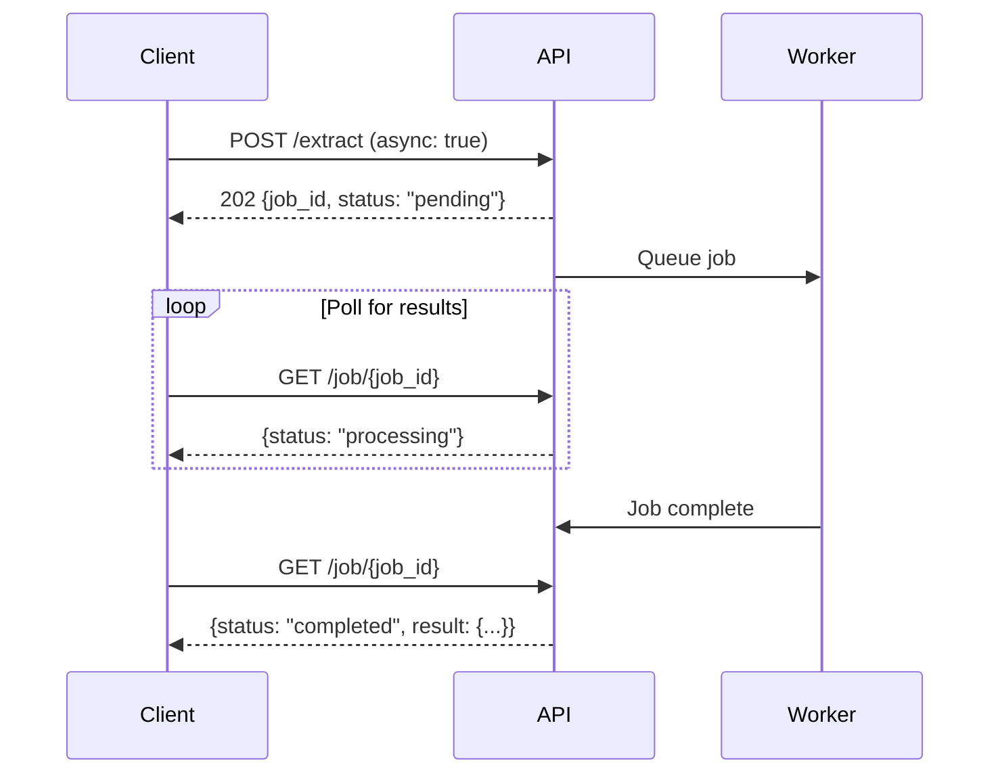

# Asynchronous Processing

For large documents or production workflows, use async processing to avoid timeouts and handle long-running operations gracefully.

## How It Works

1. **Submit** - Send your request with `async: true`
2. **Receive job ID** - Get an immediate response with a `job_id`
3. **Poll** - Check job status via `GET /job/{jobId}`
4. **Get results** - Retrieve completed results from the poll response



---

## Endpoints with Async Support

| Endpoint | Async Flag | Async Response |
|----------|------------|----------------|
| `POST /extract` | `async: true` | 202 with `job_id` |
| `POST /split` | `async: true` | 202 with `job_id` |
| `POST /schema` | `async: true` | 202 with `job_id` |

<Note>
  `POST /extract_async` is **deprecated**. Use `POST /extract` with `async: true` instead.
</Note>

---

## Using the Async Flag

Add `async: true` to any supported endpoint's request body:

<CodeGroup>

```python Python
from pulse import Pulse

client = Pulse(api_key="YOUR_API_KEY")

# Async extraction
job = client.extract(
    file_url="https://example.com/large-report.pdf",
    async_=True  # Note: async_ in Python (async is reserved)
)
print(f"Job ID: {job.job_id}")
print(f"Status: {job.status}")  # "pending"

# Async schema extraction
job = client.schema(
    extraction_id="abc123",
    structured_output={"schema": {...}},
    async_=True
)

# Async split
job = client.split(
    extraction_id="abc123",
    topics=[{"name": "financials", "description": "..."}],
    async_=True
)
```

```typescript TypeScript
const client = new PulseClient({ 
    headers: { 'x-api-key': 'YOUR_API_KEY' }
});

// Async extraction
const job = await client.extract({
    fileUrl: "https://example.com/large-report.pdf",
    async: true
});
console.log(`Job ID: ${job.job_id}`);

// Async schema extraction
const schemaJob = await client.schema.extractSchema({
    extraction_id: "abc123",
    schema_config: { schema: {...}, schema_prompt: "Extract details" },
    async: true
});
```

```bash curl
# Async extraction
curl -X POST https://api.runpulse.com/extract \
  -H "x-api-key: YOUR_API_KEY" \
  -H "Content-Type: application/json" \
  -d '{
    "file_url": "https://example.com/report.pdf",
    "async": true
  }'

# Response: {"job_id": "abc123", "status": "pending"}
```

</CodeGroup>

---

## Async Response Format

When `async: true`, you receive a **202 Accepted** response:

```json
{
  "job_id": "abc123-def456-ghi789",
  "status": "pending"
}
```

| Field | Type | Description |
|-------|------|-------------|
| `job_id` | string | Unique identifier for the async job |
| `status` | string | Initial status: `pending` or `processing` |

---

## Polling for Results

Use `GET /job/{jobId}` to check status and retrieve results:

<CodeGroup>

```python Python
import time

job_id = job.job_id

while True:
    status = client.jobs.get_job(job_id=job_id)
    print(f"Status: {status.status}")
    
    if status.status == "completed":
        print("Done!")
        print(f"Result: {status.result}")
        break
    elif status.status == "failed":
        print(f"Failed: {status.error}")
        break
    elif status.status == "canceled":
        print("Job was canceled")
        break
    
    time.sleep(2)  # Poll every 2 seconds
```

```typescript TypeScript
const pollForResult = async (jobId: string) => {
    while (true) {
        const status = await client.jobs.getJob({ jobId });
        console.log(`Status: ${status.status}`);
        
        if (status.status === 'completed') {
            return status.result;
        } else if (status.status === 'failed') {
            throw new Error(status.error);
        } else if (status.status === 'canceled') {
            throw new Error('Job canceled');
        }
        
        await new Promise(r => setTimeout(r, 2000));
    }
};

const result = await pollForResult(job.job_id);
```

```bash curl
# Poll for status
curl "https://api.runpulse.com/job/abc123-def456" \
  -H "x-api-key: YOUR_API_KEY"
```

</CodeGroup>

### Poll Response

```json
{
  "job_id": "abc123-def456-ghi789",
  "status": "completed",
  "created_at": "2026-02-04T10:30:00Z",
  "completed_at": "2026-02-04T10:30:45Z",
  "result": {
    "markdown": "# Document Content...",
    "page_count": 50,
    "structured_output": {...}
  }
}
```

### Job Status Values

| Status | Description |
|--------|-------------|
| `pending` | Job is queued, waiting to start |
| `processing` | Job is currently running |
| `completed` | Job finished successfully - results available |
| `failed` | Job encountered an error |
| `canceled` | Job was canceled by user |

---

## Canceling Jobs

Cancel a running job with `DELETE /job/{jobId}`:

<CodeGroup>

```python Python
client.jobs.cancel_job(job_id=job_id)
```

```bash curl
curl -X DELETE "https://api.runpulse.com/job/abc123" \
  -H "x-api-key: YOUR_API_KEY"
```

</CodeGroup>

---

## When to Use Async

<AccordionGroup>
  <Accordion title="Large documents (50+ pages)">
    Synchronous requests may timeout for large documents. Always use async for documents over 50 pages.
  </Accordion>
  
  <Accordion title="Complex schemas">
    Schema extraction with many fields or nested structures benefits from async processing.
  </Accordion>
  
  <Accordion title="Production workflows">
    Async provides better reliability and allows you to handle failures gracefully with retries.
  </Accordion>
  
  <Accordion title="Batch processing">
    Submit multiple documents asynchronously and poll for results in parallel.
  </Accordion>
</AccordionGroup>

---

## Sync vs Async Comparison

| Aspect | Sync (`async: false`) | Async (`async: true`) |
|--------|----------------------|----------------------|
| Response | Full result | Job ID only |
| HTTP Status | 200 | 202 |
| Timeout risk | Higher | Lower |
| Best for | Small docs, testing | Production, large docs |
| Polling needed | No | Yes |

---

## Webhooks Alternative

Instead of polling, you can use [webhooks](/svix-webhooks) to receive notifications when jobs complete:

```python
# Configure webhook via Svix portal
webhook_link = client.webhooks.get_portal()
print(f"Configure webhooks at: {webhook_link.url}")

# Submit async job - webhook will notify on completion
job = client.extract(file_url="...", async_=True)
```

See [Svix Webhooks](/svix-webhooks) for setup instructions.


