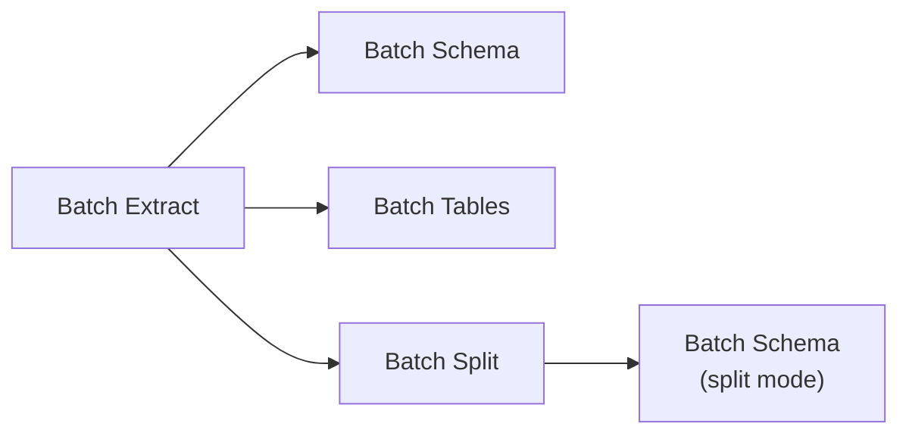

## Overview

The batch endpoints let you run any step of the Pulse pipeline across many documents at once. Each batch call is fully asynchronous — it returns a `batch_job_id` immediately and orchestrates parallel workers behind the scenes.

Poll [GET /job/{'{'}batch_job_id{'}'}](/api-reference/endpoint/poll) for real-time progress including per-item completion status and individual child job IDs.

<Info>
  Batch endpoints mirror the individual pipeline steps. Each child call goes through the exact same code path as calling the individual endpoint directly — batch is orchestration, not a separate implementation.
</Info>

### Pipeline

Batch endpoints can be chained together, just like their single-document counterparts:



Each step takes the output of a previous step as input, either via a `batch_extract_id` / `batch_split_id` that references the parent batch job, or via an explicit list of individual IDs.

### Workers

Workers process items in parallel. You can control concurrency with the `workers` parameter on every batch endpoint.

| Parameter | Type | Default | Max | Description |
|-----------|------|---------|-----|-------------|
| `workers` | integer | 4 | 10 | Number of parallel workers |

---

## Batch Extract

Enumerate files from an input source and extract content from each one.

<Info>
  See [Extract](/api-reference/endpoint/extract) for details on `extract_options` (pages, figure processing, extensions, etc.).
</Info>

### Request — `POST /batch/extract`

| Field | Type | Required | Description |
|-------|------|----------|-------------|
| `input` | object | Yes | Source of files to process (see [Input Sources](#input-sources)) |
| `output` | object | Yes | Where to save extraction results (see [Output Destinations](#output-destinations)) |
| `extract_options` | object | No | Options forwarded to each `/extract` call |
| `workers` | integer | No | Parallel workers (default: 4, max: 10) |

### Response (202)

| Field | Type | Description |
|-------|------|-------------|
| `batch_job_id` | string | Job ID for [polling](/api-reference/endpoint/poll) |
| `status` | string | `"processing"` |
| `total_files` | integer | Number of files that will be processed |

### Example

<CodeGroup>

```python Python
from pulse import Pulse
from pulse.types.batch_input_source import BatchInputSource
from pulse.types.batch_output_destination import BatchOutputDestination

client = Pulse(api_key="YOUR_API_KEY")

resp = client.batch.extract(
    input=BatchInputSource(s_3_prefix="s3://my-bucket/documents/"),
    output=BatchOutputDestination(s_3_prefix="s3://my-bucket/results/extractions/"),
    workers=10,
)

print(f"Job: {resp.batch_job_id}, files: {resp.total_files}")
```

```typescript TypeScript
import { PulseClient } from "pulse-ts-sdk";

const client = new PulseClient({ apiKey: "YOUR_API_KEY" });

const resp = await client.batch.extract({
    input: { s3_prefix: "s3://my-bucket/documents/" },
    output: { s3_prefix: "s3://my-bucket/results/extractions/" },
    workers: 10,
});

console.log(`Job: ${resp.batchJobId}, files: ${resp.totalFiles}`);
```

```bash curl
curl -X POST https://api.runpulse.com/batch/extract \
  -H "x-api-key: YOUR_API_KEY" \
  -H "Content-Type: application/json" \
  -d '{
    "input": { "s3_prefix": "s3://my-bucket/documents/" },
    "output": { "s3_prefix": "s3://my-bucket/results/extractions/" },
    "workers": 10
  }'
```

</CodeGroup>

---

## Batch Schema

Apply structured data extraction to multiple items. Supports two modes, inferred from input:

- **Single mode** — Provide `extraction_ids` or `batch_extract_id` with `schema_config`
- **Split mode** — Provide `split_ids` or `batch_split_id` with `split_schema_config`

<Info>
  See [Schema](/api-reference/endpoint/schema) for details on `schema_config`, `split_schema_config`, and the difference between single and split modes.
</Info>

### Request — `POST /batch/schema`

| Field | Type | Required | Description |
|-------|------|----------|-------------|
| `output` | object | Yes | Where to save schema results |
| `batch_extract_id` | string | XOR | ID of a prior batch extract run (single mode) |
| `extraction_ids` | array | XOR | Explicit list of extraction IDs (single mode) |
| `batch_split_id` | string | XOR | ID of a prior batch split run (split mode) |
| `split_ids` | array | XOR | Explicit list of split IDs (split mode) |
| `schema_config` | object | Conditional | Schema configuration for single mode |
| `split_schema_config` | object | Conditional | Per-topic schema configurations for split mode |
| `workers` | integer | No | Parallel workers (default: 4, max: 10) |

### Response (202)

| Field | Type | Description |
|-------|------|-------------|
| `batch_job_id` | string | Job ID for [polling](/api-reference/endpoint/poll) |
| `status` | string | `"processing"` |
| `total_extractions` | integer | Number of extractions to process (single mode) |
| `total_splits` | integer | Number of splits to process (split mode) |

### Example — Single Mode

<CodeGroup>

```python Python
from pulse.types.schema_config import SchemaConfig

resp = client.batch.schema(
    batch_extract_id="<batch_extract_job_id>",
    output=BatchOutputDestination(s_3_prefix="s3://my-bucket/results/schemas/"),
    schema_config=SchemaConfig(
        input_schema={
            "type": "object",
            "properties": {
                "total_amount": {"type": "number"},
                "vendor_name": {"type": "string"},
            },
        },
        schema_prompt="Extract invoice details",
    ),
    workers=10,
)
```

```typescript TypeScript
const resp = await client.batch.schema({
    batchExtractId: "<batch_extract_job_id>",
    output: { s3_prefix: "s3://my-bucket/results/schemas/" },
    schemaConfig: {
        inputSchema: {
            type: "object",
            properties: {
                total_amount: { type: "number" },
                vendor_name: { type: "string" },
            },
        },
        schemaPrompt: "Extract invoice details",
    },
    workers: 10,
});
```

```bash curl
curl -X POST https://api.runpulse.com/batch/schema \
  -H "x-api-key: YOUR_API_KEY" \
  -H "Content-Type: application/json" \
  -d '{
    "batch_extract_id": "<batch_extract_job_id>",
    "output": { "s3_prefix": "s3://my-bucket/results/schemas/" },
    "schema_config": {
      "input_schema": {
        "type": "object",
        "properties": {
          "total_amount": {"type": "number"},
          "vendor_name": {"type": "string"}
        }
      },
      "schema_prompt": "Extract invoice details"
    },
    "workers": 10
  }'
```

</CodeGroup>

### Example — Split Mode

<CodeGroup>

```python Python
from pulse.types.topic_schema_config import TopicSchemaConfig

resp = client.batch.schema(
    batch_split_id="<batch_split_job_id>",
    output=BatchOutputDestination(s_3_prefix="s3://my-bucket/results/schema-splits/"),
    split_schema_config={
        "financial_statements": TopicSchemaConfig(
            schema_={"type": "object", "properties": {"revenue": {"type": "number"}}},
            schema_prompt="Extract financial data",
        ),
        "risk_factors": TopicSchemaConfig(
            schema_={"type": "object", "properties": {"risks": {"type": "array", "items": {"type": "string"}}}},
        ),
    },
    workers=10,
)
```

```bash curl
curl -X POST https://api.runpulse.com/batch/schema \
  -H "x-api-key: YOUR_API_KEY" \
  -H "Content-Type: application/json" \
  -d '{
    "batch_split_id": "<batch_split_job_id>",
    "output": { "s3_prefix": "s3://my-bucket/results/schema-splits/" },
    "split_schema_config": {
      "financial_statements": {
        "schema": {"type": "object", "properties": {"revenue": {"type": "number"}}},
        "schema_prompt": "Extract financial data"
      },
      "risk_factors": {
        "schema": {"type": "object", "properties": {"risks": {"type": "array", "items": {"type": "string"}}}}
      }
    },
    "workers": 10
  }'
```

</CodeGroup>

---

## Batch Tables

Extract tables from multiple existing extractions.

<Info>
  See [Tables](/api-reference/endpoint/tables) for details on `tables_config` (merge, table format, etc.).
</Info>

### Request — `POST /batch/tables`

| Field | Type | Required | Description |
|-------|------|----------|-------------|
| `output` | object | Yes | Where to save table results |
| `batch_extract_id` | string | XOR | ID of a prior batch extract run |
| `extraction_ids` | array | XOR | Explicit list of extraction IDs |
| `tables_config` | object | No | Table extraction configuration |
| `workers` | integer | No | Parallel workers (default: 4, max: 10) |

### Response (202)

| Field | Type | Description |
|-------|------|-------------|
| `batch_job_id` | string | Job ID for [polling](/api-reference/endpoint/poll) |
| `status` | string | `"processing"` |
| `total_extractions` | integer | Number of extractions to process |

### Example

<CodeGroup>

```python Python
resp = client.batch.tables(
    batch_extract_id="<batch_extract_job_id>",
    output=BatchOutputDestination(s_3_prefix="s3://my-bucket/results/tables/"),
    tables_config=TablesConfig(merge=True, table_format="html"),
    workers=10,
)
```

```bash curl
curl -X POST https://api.runpulse.com/batch/tables \
  -H "x-api-key: YOUR_API_KEY" \
  -H "Content-Type: application/json" \
  -d '{
    "batch_extract_id": "<batch_extract_job_id>",
    "output": { "s3_prefix": "s3://my-bucket/results/tables/" },
    "tables_config": { "merge": true, "table_format": "html" },
    "workers": 10
  }'
```

</CodeGroup>

---

## Batch Split

Split multiple extractions into topics.

<Info>
  See [Split](/api-reference/endpoint/split) for details on `split_config` (topic definitions with names and descriptions).
</Info>

### Request — `POST /batch/split`

| Field | Type | Required | Description |
|-------|------|----------|-------------|
| `output` | object | Yes | Where to save split results |
| `split_config` | object | Yes | Split configuration with topic definitions |
| `batch_extract_id` | string | XOR | ID of a prior batch extract run |
| `extraction_ids` | array | XOR | Explicit list of extraction IDs |
| `workers` | integer | No | Parallel workers (default: 4, max: 10) |

### Response (202)

| Field | Type | Description |
|-------|------|-------------|
| `batch_job_id` | string | Job ID for [polling](/api-reference/endpoint/poll) |
| `status` | string | `"processing"` |
| `total_extractions` | integer | Number of extractions to process |

### Example

<CodeGroup>

```python Python
from pulse.types.split_config import SplitConfig
from pulse.types.topic_definition import TopicDefinition

resp = client.batch.split(
    batch_extract_id="<batch_extract_job_id>",
    output=BatchOutputDestination(s_3_prefix="s3://my-bucket/results/splits/"),
    split_config=SplitConfig(
        split_input=[
            TopicDefinition(name="financial_statements", description="Balance sheets, income statements"),
            TopicDefinition(name="risk_factors", description="Risk factors and forward-looking statements"),
        ],
    ),
    workers=10,
)
```

```bash curl
curl -X POST https://api.runpulse.com/batch/split \
  -H "x-api-key: YOUR_API_KEY" \
  -H "Content-Type: application/json" \
  -d '{
    "batch_extract_id": "<batch_extract_job_id>",
    "output": { "s3_prefix": "s3://my-bucket/results/splits/" },
    "split_config": {
      "split_input": [
        {"name": "financial_statements", "description": "Balance sheets, income statements"},
        {"name": "risk_factors", "description": "Risk factors and forward-looking statements"}
      ]
    },
    "workers": 10
  }'
```

</CodeGroup>

---

## Input and Output

### Input Sources

Batch Extract accepts one of the following input sources:

| Source | Field | Example |
|--------|-------|---------|
| S3 prefix | `s3_prefix` | `s3://my-bucket/documents/` |
| Local directory | `local_path` | `/data/documents/` |
| URL list | `file_urls` | `["https://example.com/doc.pdf"]` |

All other batch endpoints reference prior results via IDs rather than raw files.

### Output Destinations

Every batch endpoint writes results to an output destination. You can specify one or both:

| Destination | Field | Example |
|-------------|-------|---------|
| S3 prefix | `s3_prefix` | `s3://my-bucket/results/` |
| Local directory | `local_path` | `/data/results/` |

---

## Monitoring Progress

Poll [GET /job/{'{'}batch_job_id{'}'}](/api-reference/endpoint/poll) to monitor a batch job. The response includes a `result` object with structured progress:

```json
{
  "status": "processing",
  "result": {
    "progress": {
      "total": 10,
      "completed": 7,
      "failed": 1
    },
    "jobs": {
      "completed": [
        { "job_id": "abc-123", "file": "report.pdf" }
      ],
      "failed": [
        { "job_id": "def-456", "file": "corrupt.pdf", "error": "..." }
      ],
      "processing": ["ghi-789"]
    }
  }
}
```

Each child `job_id` can be polled individually for detailed results.

### Polling Example

<CodeGroup>

```python Python
import time

job_id = resp.batch_job_id

while True:
    job = client.jobs.get_job(job_id=job_id)

    if job.status in ("completed", "failed", "canceled"):
        print(f"Final status: {job.status}")
        break

    if job.result and "progress" in job.result:
        p = job.result["progress"]
        print(f"{p['completed']}/{p['total']} completed, {p['failed']} failed")

    time.sleep(5)
```

```typescript TypeScript
let job = await client.jobs.getJob(resp.batchJobId);

while (job.status !== "completed" && job.status !== "failed" && job.status !== "canceled") {
    await new Promise(r => setTimeout(r, 5000));
    job = await client.jobs.getJob(resp.batchJobId);

    if (job.result?.progress) {
        const p = job.result.progress;
        console.log(`${p.completed}/${p.total} completed, ${p.failed} failed`);
    }
}

console.log(`Final status: ${job.status}`);
```

</CodeGroup>

---

## Cancellation

Cancel a batch job with [DELETE /job/{'{'}batch_job_id{'}'}](/api-reference/endpoint/cancel). This cascades to all child jobs that are still pending or processing.

---

## Full Pipeline Example

Process a folder of SEC filings: extract all files, apply a schema, extract tables, split by topic, and apply per-topic schemas.

<CodeGroup>

```python Python
from pulse import Pulse
from pulse.types.batch_input_source import BatchInputSource
from pulse.types.batch_output_destination import BatchOutputDestination
from pulse.types.schema_config import SchemaConfig
from pulse.types.split_config import SplitConfig
from pulse.types.tables_config import TablesConfig
from pulse.types.topic_definition import TopicDefinition
from pulse.types.topic_schema_config import TopicSchemaConfig
import time

client = Pulse(api_key="YOUR_API_KEY")

def wait_for_job(job_id: str) -> dict:
    while True:
        job = client.jobs.get_job(job_id=job_id)
        if job.status in ("completed", "failed", "canceled"):
            return {"status": job.status, "result": job.result}
        time.sleep(5)

# Step 1: Batch Extract
extract = client.batch.extract(
    input=BatchInputSource(s_3_prefix="s3://my-bucket/10-K/"),
    output=BatchOutputDestination(s_3_prefix="s3://my-bucket/results/extractions/"),
    workers=10,
)
extract_result = wait_for_job(extract.batch_job_id)

# Step 2: Batch Schema
schema = client.batch.schema(
    batch_extract_id=extract.batch_job_id,
    output=BatchOutputDestination(s_3_prefix="s3://my-bucket/results/schemas/"),
    schema_config=SchemaConfig(
        input_schema={"type": "object", "properties": {"revenue": {"type": "number"}}},
    ),
    workers=10,
)
wait_for_job(schema.batch_job_id)

# Step 3: Batch Tables
tables = client.batch.tables(
    batch_extract_id=extract.batch_job_id,
    output=BatchOutputDestination(s_3_prefix="s3://my-bucket/results/tables/"),
    tables_config=TablesConfig(merge=True, table_format="html"),
    workers=10,
)
wait_for_job(tables.batch_job_id)

# Step 4: Batch Split
split = client.batch.split(
    batch_extract_id=extract.batch_job_id,
    output=BatchOutputDestination(s_3_prefix="s3://my-bucket/results/splits/"),
    split_config=SplitConfig(split_input=[
        TopicDefinition(name="financials", description="Financial statements"),
        TopicDefinition(name="risk_factors", description="Risk disclosures"),
    ]),
    workers=10,
)
wait_for_job(split.batch_job_id)

# Step 5: Batch Schema (split mode)
split_schema = client.batch.schema(
    batch_split_id=split.batch_job_id,
    output=BatchOutputDestination(s_3_prefix="s3://my-bucket/results/schema-splits/"),
    split_schema_config={
        "financials": TopicSchemaConfig(
            schema_={"type": "object", "properties": {"revenue": {"type": "number"}}},
        ),
        "risk_factors": TopicSchemaConfig(
            schema_={"type": "object", "properties": {"risks": {"type": "array", "items": {"type": "string"}}}},
        ),
    },
    workers=10,
)
wait_for_job(split_schema.batch_job_id)
```

</CodeGroup>

---

## Related Endpoints

<CardGroup cols={2}>
  <Card title="Extract" icon="file-lines" href="/api-reference/endpoint/extract">
    Individual file extraction — config options apply to Batch Extract
  </Card>
  <Card title="Schema" icon="table-columns" href="/api-reference/endpoint/schema">
    Single/split schema extraction — config options apply to Batch Schema
  </Card>
  <Card title="Tables" icon="table" href="/api-reference/endpoint/tables">
    Table extraction — config options apply to Batch Tables
  </Card>
  <Card title="Split" icon="scissors" href="/api-reference/endpoint/split">
    Topic splitting — config options apply to Batch Split
  </Card>
  <Card title="Poll Job" icon="clock" href="/api-reference/endpoint/poll">
    Poll batch job progress
  </Card>
  <Card title="Cancel Job" icon="xmark" href="/api-reference/endpoint/cancel">
    Cancel a batch job and all child jobs
  </Card>
</CardGroup>
