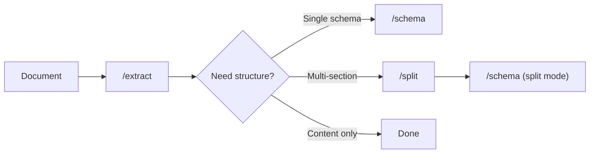

# Document Processing Pipelines

A pipeline is a sequence of API calls that process a document from raw file to structured data. You define each step in the Pulse Playground, test it interactively, then deploy it at scale using the generated SDK code.

## Supported Pipelines

There are four valid pipeline configurations:

| Pipeline | Steps | Use Case |
|----------|-------|----------|
| **Extract** | `/extract` | Basic content extraction — markdown, tables, figures |
| **Extract → Schema** | `/extract` → `/schema` | Extract + apply a schema to get structured data |
| **Extract → Split** | `/extract` → `/split` | Extract + split document into topic-based page groups |
| **Extract → Split → Schema** | `/extract` → `/split` → `/schema` | Full pipeline — extract, split by topic, apply per-topic schemas |



---

## How It Works

### Step 1: Extract

Every pipeline starts with [`/extract`](/api-reference/endpoint/extract). This processes your document and returns markdown content, bounding boxes, and optional figures.

```python
result = client.extract(
    file=open("document.pdf", "rb"),
    extract_figure=True
)
extraction_id = result.extraction_id
```

<Note>
  Storage is enabled by default. The `extraction_id` returned in the response is used to reference the saved extraction in subsequent pipeline steps. If you explicitly disable storage (`storage.enabled: false`), the extraction won't be available for split or schema steps.
</Note>

### Step 2 (Option A): Schema Extraction

For documents where you need structured data from the entire document, call [`/schema`](/api-reference/endpoint/schema) with the `extraction_id`:

```python
schema_result = client.schema(
    extraction_id=extraction_id,
    schema_config={
        "schema": {
            "type": "object",
            "properties": {
                "invoice_number": {"type": "string"},
                "total_amount": {"type": "number"}
            }
        },
        "schema_prompt": "Extract invoice details"
    }
)
```

### Step 2 (Option B): Split Document

For multi-section documents (annual reports, contracts, medical records), call [`/split`](/api-reference/endpoint/split) to identify which pages contain each topic:

```python
split_result = client.split(
    extraction_id=extraction_id,
    split_config={
        "topics": [
            {"name": "financials", "description": "Balance sheets and income statements"},
            {"name": "risk_factors", "description": "Risk disclosures and legal disclaimers"}
        ]
    }
)
split_id = split_result.split_id
```

### Step 3: Schema on Split Results

After splitting, call [`/schema`](/api-reference/endpoint/schema) with the `split_id` to apply different schemas to each topic's pages:

```python
schema_result = client.schema(
    split_id=split_id,
    split_schema_config={
        "financials": {
            "schema": {"type": "object", "properties": {"revenue": {"type": "number"}}},
            "schema_prompt": "Extract financial metrics"
        },
        "risk_factors": {
            "schema": {"type": "object", "properties": {"risk": {"type": "string"}}}
        }
    }
)
```

---

## Saved Configurations

Each step's configuration can be saved to a **config library** for reuse:

- **Extraction configs** — page ranges, figure settings, chunking options
- **Split configs** — topic definitions with names and descriptions
- **Schema configs** — JSON schemas with prompts and effort settings

When a step uses a saved config, you reference it by ID instead of passing the full configuration inline:

```python
# Using saved config IDs
result = client.extract(
    file=open("document.pdf", "rb"),
    extraction_config_id="abc-123"
)

schema_result = client.schema(
    extraction_id=result.job_id,
    schema_config_id="def-456"
)
```

This makes your pipeline code cleaner and ensures consistency when processing many documents with the same configuration.

---

## From Playground to Production

The Pulse Playground lets you build and test pipelines interactively:

1. **Configure** each step using the visual pipeline builder
2. **Run** the pipeline on a test document to verify results
3. **Save** the pipeline — each step's config is saved to your library
4. **Export** — click the **Show Code** button in the top-right corner of the extraction results panel

The **Show Code** feature generates ready-to-use SDK code (Python, TypeScript, or cURL) that replicates your exact pipeline configuration. If your steps use saved presets, the generated code references their config IDs directly — no need to copy-paste JSON schemas.

<Frame>
  
</Frame>

### Deploying at Scale

Once you have the generated code, you can deploy it in production to process documents at scale:

```python
from pulse import Pulse
import os

client = Pulse(api_key=os.environ["PULSE_API_KEY"])

documents = ["invoice_001.pdf", "invoice_002.pdf", "invoice_003.pdf"]

for doc_path in documents:
    # Extract
    result = client.extract(
        file=open(doc_path, "rb"),
        extraction_config_id="your-extraction-config-id"
    )
    
    # Apply schema using saved config
    schema_result = client.schema(
        extraction_id=result.extraction_id,
        schema_config_id="your-schema-config-id"
    )
    
    print(f"{doc_path}: {schema_result.schema_output['values']}")
```

For high-throughput processing, use `async: true` on each step and poll for results:

```python
# Start async extraction
job = client.extract(
    file=open(doc_path, "rb"),
    extraction_config_id="your-extraction-config-id",
    async_=True  # Returns immediately with job_id
)

# Poll for completion
result = client.get_job(job.job_id)  # Repeat until status is "completed"
```

See [Polling for Results](/api-reference/endpoint/poll) for details on async processing.

---

## Pipeline Steps Reference

<CardGroup cols={3}>
  <Card title="Extract" icon="file-lines" href="/api-reference/endpoint/extract">
    Step 1 — Parse documents into markdown, tables, and figures
  </Card>
  <Card title="Split" icon="scissors" href="/api-reference/endpoint/split">
    Step 2 — Split document into topic-based page groups
  </Card>
  <Card title="Schema" icon="table-columns" href="/api-reference/endpoint/schema">
    Step 2/3 — Apply schemas to extract structured data
  </Card>
</CardGroup>

