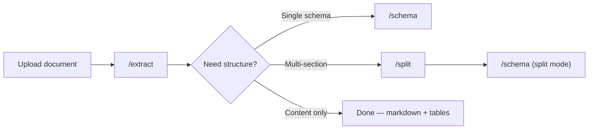

> Transform complex documents into structured data — with production-grade accuracy.

<CardGroup cols={3}>
  <Card title="Playground" icon="browser" href="https://platform.runpulse.com">
    Upload documents and build extraction pipelines in a visual UI.
  </Card>
  <Card title="Console" icon="gauge" href="https://console.runpulse.com">
    Manage API keys, view usage, and configure your organization.
  </Card>
  <Card title="Support" icon="envelope" href="mailto:support@trypulse.ai">
    Reach our team at support@trypulse.ai
  </Card>
</CardGroup>

Pulse parses and extracts data from complex enterprise documents including PDFs, spreadsheets, presentations, images, and more. The platform is designed for high-quality document understanding rather than traditional OCR, using in-house systems for layout, reading order, tables, charts, handwriting, and complex document structures.

At this scale, Pulse is running inside some of the most demanding production environments in the world, including Fortune 50 technology organizations, top global private equity firms, large insurance carriers, and fast-growing AI-native teams, with over one billion pages processed.

---

## How it works



1. **Upload** — Send a PDF, image, spreadsheet, or [other supported format](/api-reference/supported-file-types)
2. **Extract** — Pulse processes the document: OCR, layout detection, table extraction, figure extraction
3. **Structure** — Optionally split into topics and apply schemas for structured JSON output

---

## How to use Pulse

<CardGroup cols={2}>
  <Card title="API & SDKs" icon="code" href="/quickstart">
    For developers building automated pipelines. Available in Python, TypeScript, and REST.
  </Card>

  <Card title="Pulse Playground" icon="browser" href="https://platform.runpulse.com">
    Visual document processing UI. Upload files, build pipelines, and see results instantly.
  </Card>
</CardGroup>

---

## Pipeline Steps

<CardGroup cols={3}>
  <Card title="Extract" icon="file-lines" href="/api-reference/endpoint/extract">
    Parse documents into markdown, tables, and figures with layout-aware processing.
  </Card>
  <Card title="Split" icon="scissors" href="/api-reference/endpoint/split">
    Divide documents into topic-based page groups for targeted processing.
  </Card>
  <Card title="Schema" icon="brackets-curly" href="/api-reference/endpoint/schema">
    Apply schemas to extract structured JSON data from documents or topics.
  </Card>
</CardGroup>

---

## Use cases

Teams use Pulse to automate document processing across industries:

- **Financial services** — Bank statement parsing, transaction extraction, 10-K analysis, invoice processing
- **Insurance** — Claims data extraction, ACORD form processing, policy analysis, underwriting automation
- **Healthcare** — Lab report structuring, patient data extraction, medical records (HIPAA compliant)
- **Legal** — Contract clause extraction, court filing analysis, patent processing, due diligence
- **Private equity** — Portfolio company document analysis, data room processing, financial model extraction

---

## Security & Compliance

<CardGroup cols={4}>
  <Card title="SOC 2 Type II" icon="shield-check">
    Audited security controls
  </Card>
  <Card title="ISO 27001" icon="certificate">
    Certified ISMS
  </Card>
  <Card title="HIPAA" icon="hospital">
    Compliant processing
  </Card>
  <Card title="GDPR" icon="lock">
    EU data compliant
  </Card>
</CardGroup>

Encryption at rest (AES-256) and in transit (TLS 1.2+). Automatic deletion after 48 hours. No data used for training. [Learn more →](https://www.runpulse.com/security)

---

## Get started

<CardGroup cols={2}>
  <Card title="API Quickstart" icon="rocket" href="/quickstart">
    Parse your first document in 5 minutes with Python, TypeScript, or REST.
  </Card>
  <Card title="Pulse Playground" icon="browser" href="https://platform.runpulse.com">
    Try Pulse in your browser — no setup required.
  </Card>
</CardGroup>

## Base URL

All API requests should be made to:

```
https://api.runpulse.com
```

## Need Help?

<CardGroup cols={2}>
  <Card title="Email Support" icon="envelope" href="mailto:support@trypulse.ai">
    support@trypulse.ai
  </Card>
  <Card title="Contact Founders" icon="users" href="mailto:founders@trypulse.ai">
    founders@trypulse.ai
  </Card>
</CardGroup>
