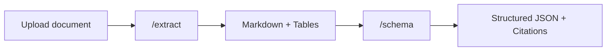

## Overview

The **Extract → Schema** pipeline adds structured data extraction on top of the base extraction. You define a JSON Schema describing the fields you want, and Pulse extracts them from the entire document as structured JSON with citations.



---

## When to Use

- **Invoice processing** — extract vendor name, invoice number, line items, totals
- **Form extraction** — pull fields from applications, tax forms, insurance claims
- **Contract parsing** — extract parties, dates, clauses, obligations
- **Single-structure documents** — any document where one schema covers the entire content

<Tip>
  If your document has **distinct sections** that need **different schemas** (e.g., an annual report with Financials, Leadership, and Outlook), use [Extract → Split → Schema](/platform-reference/extract-split-schema) instead.
</Tip>

---

## How to Use in the Playground

<Steps>

### Configure extraction settings

Set page range, figure extraction, chunking, and other options on the **Configuration** tab — same as [Extract Only](/platform-reference/extract).

### Define your schema

Switch to the **Schema** step in the pipeline tabs. Define a JSON Schema describing the fields you want to extract:

```json
{
  "type": "object",
  "properties": {
    "invoice_number": { "type": "string", "description": "The invoice identifier" },
    "vendor_name": { "type": "string", "description": "Name of the vendor or seller" },
    "total_amount": { "type": "number", "description": "Total amount due" },
    "due_date": { "type": "string", "description": "Payment due date" },
    "line_items": {
      "type": "array",
      "items": {
        "type": "object",
        "properties": {
          "description": { "type": "string" },
          "quantity": { "type": "integer" },
          "unit_price": { "type": "number" }
        }
      }
    }
  },
  "required": ["invoice_number", "vendor_name"]
}
```

Optionally add a **schema prompt** to guide the extraction — e.g., *"Extract billing details from this invoice. Line items should include all products listed."*

{/* SCREENSHOT: schema-editor.png — The schema step showing the JSON editor and schema prompt */}

### Upload and extract

Click **Extract All**. The pipeline runs both steps automatically:
1. **Extract** — processes the document into markdown
2. **Schema** — applies your schema to the extracted content

### Review structured output

Results appear in the **Schema** tab as structured JSON. Each extracted field includes **citations** pointing to the exact location in the document where the value was found.

{/* SCREENSHOT: schema-results.png — The schema results view showing extracted JSON and citations */}

</Steps>

---

## What You Get Back

Everything from [Extract](/platform-reference/extract), plus:

| Field | Description |
|-------|-------------|
| `schema_output.values` | Extracted field values matching your JSON Schema |
| `schema_output.citations` | Source locations for each extracted value |
| `schema_id` | Saved schema result ID |

---

## Schema Tips

<AccordionGroup>
  <Accordion title="Use descriptions on every field">
    The `description` property in your JSON Schema helps Pulse understand what to look for. Be specific:
    
    ```json
    // Good
    "vendor_name": { "type": "string", "description": "Full legal name of the vendor or seller, as shown in the invoice header" }
    
    // Less helpful
    "vendor_name": { "type": "string" }
    ```
  </Accordion>

  <Accordion title="Use required fields strategically">
    Mark fields as `required` when you know they'll always be present. Optional fields are returned as `null` if not found.
  </Accordion>

  <Accordion title="Use arrays for repeating items">
    For tables or lists in the document (line items, attendees, clauses), use `"type": "array"` with an `items` schema.
  </Accordion>

  <Accordion title="Add a schema prompt for context">
    The schema prompt gives the extraction model additional context. Use it to clarify ambiguities or specify preferences.
  </Accordion>

  <Accordion title="Enable effort mode for complex schemas">
    If your schema has many nested fields or the document layout is complex, enable **Effort mode** in the extraction settings for higher accuracy.
  </Accordion>
</AccordionGroup>

---

## API Usage

<Tabs>
  <Tab title="Python">
    ```python
    from pulse_python_sdk import Pulse

    client = Pulse(api_key="YOUR_API_KEY")

    # Step 1: Extract the document
    extract_result = client.extract(
        file=open("invoice.pdf", "rb"),
        async_=True,
        storage={"enabled": True}
    )

    # Poll for completion, then get extraction_id
    extraction_id = extract_result.extraction_id

    # Step 2: Apply schema
    schema_result = client.schema.extract_schema(
        extraction_id=extraction_id,
        schema_config={
            "schema": {
                "type": "object",
                "properties": {
                    "invoice_number": {"type": "string"},
                    "vendor_name": {"type": "string"},
                    "total_amount": {"type": "number"},
                    "line_items": {
                        "type": "array",
                        "items": {
                            "type": "object",
                            "properties": {
                                "description": {"type": "string"},
                                "quantity": {"type": "integer"},
                                "unit_price": {"type": "number"}
                            }
                        }
                    }
                },
                "required": ["invoice_number", "vendor_name"]
            },
            "schema_prompt": "Extract all billing details from this invoice"
        }
    )

    print(schema_result.schema_output)
    ```
  </Tab>
  <Tab title="TypeScript">
    ```typescript
    import { PulseClient } from "pulse-ts-sdk";
    import fs from "fs";

    const client = new PulseClient({
        headers: { "x-api-key": "YOUR_API_KEY" }
    });

    // Step 1: Extract the document
    const extractResult = await client.extract({
        file: fs.createReadStream("invoice.pdf"),
        async: true,
        storage: { enabled: true }
    });

    const extractionId = extractResult.extractionId;

    // Step 2: Apply schema
    const schemaResult = await client.schema.extractSchema({
        extraction_id: extractionId,
        schema_config: {
            schema: {
                type: "object",
                properties: {
                    invoice_number: { type: "string" },
                    vendor_name: { type: "string" },
                    total_amount: { type: "number" },
                    line_items: {
                        type: "array",
                        items: {
                            type: "object",
                            properties: {
                                description: { type: "string" },
                                quantity: { type: "integer" },
                                unit_price: { type: "number" }
                            }
                        }
                    }
                },
                required: ["invoice_number", "vendor_name"]
            },
            schema_prompt: "Extract all billing details from this invoice"
        }
    });

    console.log(schemaResult.schemaOutput);
    ```
  </Tab>
  <Tab title="curl">
    ```bash
    # Step 1: Extract the document
    curl -X POST https://api.runpulse.com/extract \
      -H "x-api-key: YOUR_API_KEY" \
      -F "file=@invoice.pdf" \
      -F "async=true" \
      -F 'storage={"enabled": true}'

    # Save extraction_id from the response
    # EXTRACTION_ID="<from response>"

    # Step 2: Apply schema
    curl -X POST https://api.runpulse.com/schema \
      -H "x-api-key: YOUR_API_KEY" \
      -H "Content-Type: application/json" \
      -d '{
        "extraction_id": "EXTRACTION_ID",
        "schema_config": {
          "schema": {
            "type": "object",
            "properties": {
              "invoice_number": {"type": "string"},
              "vendor_name": {"type": "string"},
              "total_amount": {"type": "number"}
            },
            "required": ["invoice_number", "vendor_name"]
          },
          "schema_prompt": "Extract all billing details from this invoice"
        }
      }'
    ```
  </Tab>
</Tabs>

---

## Iterating on Your Schema

You don't need to re-extract the document to try a different schema. Use a **Schema-Only Rerun** — see [Reruns](/platform-reference/reruns) for details.

---

## Related

<CardGroup cols={2}>
  <Card title="Schema API Reference" icon="table" href="/api-reference/endpoint/schema">
    Full API documentation for the `/schema` endpoint
  </Card>
  <Card title="Schema Guidelines" icon="book" href="/api-reference/structured-output-guidelines">
    Best practices for writing effective schemas
  </Card>
</CardGroup>

