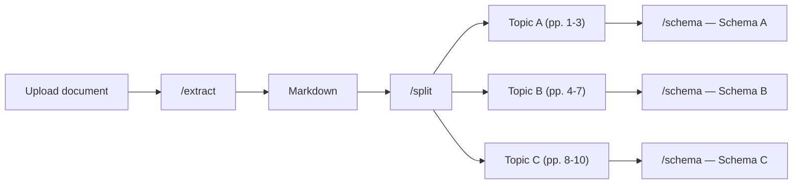

## Overview

The **Extract → Split → Schema** pipeline is the most powerful processing mode in Pulse. After extracting the document, it splits the pages into topic-based sections and then applies a **different schema** to each section. This is ideal for long, multi-section documents where different parts contain different kinds of data.



---

## When to Use

- **Annual reports** — Financials, Leadership, and Outlook each have different data to extract
- **Multi-section contracts** — different clause types (indemnification, IP rights, payment terms) need different schemas
- **Research papers** — Abstract, Methodology, Results, and Conclusion each have distinct structure
- **Insurance documents** — policy details, claims history, and coverage schedules are all different
- **Regulatory filings** — mixed sections like company overview, financial statements, risk factors

<Tip>
  If your entire document uses **one schema**, use [Extract → Schema](/platform-reference/extract-schema) instead — it's simpler and faster.
</Tip>

---

## How to Use in the Playground

<Steps>

### Configure extraction settings

Set page range, figure extraction, chunking, and other options on the **Configuration** tab — same as [Extract Only](/platform-reference/extract).

### Define split topics

Switch to the **Split** step. Add topics with names and descriptions — Pulse uses these to assign pages to topics based on document content.

| Topic | Description |
|-------|-------------|
| Financials | Revenue, expenses, and profit data |
| Leadership | Executive team and board of directors |
| Outlook | Future plans, projections, and guidance |

{/* SCREENSHOT: split-topics-editor.png — The split step showing topic name and description fields */}

<Info>
  The split step assigns **whole pages** to topics. A page belongs to the topic that best matches its content. Pages can only belong to one topic.
</Info>

### Define per-topic schemas

For each topic, define a JSON Schema tailored to the data you expect in that section. Each topic gets its own schema and optional prompt.

**Example — Financials schema:**
```json
{
  "type": "object",
  "properties": {
    "total_revenue": { "type": "number", "description": "Total revenue for the fiscal year" },
    "net_income": { "type": "number", "description": "Net income after taxes" },
    "revenue_growth_pct": { "type": "number", "description": "Year-over-year revenue growth %" }
  },
  "required": ["total_revenue"]
}
```

**Example — Leadership schema:**
```json
{
  "type": "object",
  "properties": {
    "ceo": { "type": "string", "description": "Name of the CEO" },
    "board_members": {
      "type": "array",
      "items": { "type": "string" },
      "description": "List of board member names"
    }
  }
}
```

{/* SCREENSHOT: per-topic-schema-editor.png — The schema editor showing different schemas for each topic */}

### Upload and extract

Click **Extract All**. The pipeline chains all three steps automatically:
1. **Extract** — converts the document to markdown
2. **Split** — assigns pages to topics based on content
3. **Schema** — runs each topic's schema against its assigned pages

### Review results

Results appear organized by topic. Switch between topics to see:
- **Page assignments** — which pages belong to each topic
- **Structured output** — the JSON extracted for each topic
- **Citations** — where in the document each value was found

{/* SCREENSHOT: split-schema-results.png — The results view organized by topic with per-topic JSON */}

</Steps>

---

## What You Get Back

Everything from [Extract](/platform-reference/extract), plus:

| Field | Description |
|-------|-------------|
| `split_output.splits` | Page assignments — `{ "Financials": [1,2,3], "Leadership": [4,5] }` |
| `split_id` | Saved split result ID |
| `results` | Per-topic structured output with `values` and `citations` for each topic |
| `schema_id` | Saved schema result ID |

---

## API Usage

<Tabs>
  <Tab title="Python">
    ```python
    from pulse_python_sdk import Pulse

    client = Pulse(api_key="YOUR_API_KEY")

    # Step 1: Extract
    extract_result = client.extract(
        file=open("annual_report.pdf", "rb"),
        async_=True,
        storage={"enabled": True}
    )
    extraction_id = extract_result.extraction_id

    # Step 2: Split
    split_result = client.split.document(
        extraction_id=extraction_id,
        split_config={
            "topics": [
                {"name": "Financials", "description": "Revenue, expenses, and profit data"},
                {"name": "Leadership", "description": "Executive team and board members"},
                {"name": "Outlook", "description": "Future plans and projections"}
            ]
        }
    )
    split_id = split_result.split_id
    print(f"Split: {split_result.split_output}")

    # Step 3: Schema per topic
    schema_result = client.schema.extract_schema(
        split_id=split_id,
        split_schema_config={
            "Financials": {
                "schema": {
                    "type": "object",
                    "properties": {
                        "total_revenue": {"type": "number"},
                        "net_income": {"type": "number"}
                    }
                },
                "schema_prompt": "Extract financial metrics"
            },
            "Leadership": {
                "schema": {
                    "type": "object",
                    "properties": {
                        "ceo": {"type": "string"},
                        "board_members": {"type": "array", "items": {"type": "string"}}
                    }
                },
                "schema_prompt": "Extract leadership information"
            },
            "Outlook": {
                "schema": {
                    "type": "object",
                    "properties": {
                        "guidance": {"type": "string"},
                        "growth_target": {"type": "number"}
                    }
                },
                "schema_prompt": "Extract forward-looking statements"
            }
        }
    )

    for topic, data in schema_result.results.items():
        print(f"{topic}: {data}")
    ```
  </Tab>
  <Tab title="TypeScript">
    ```typescript
    import { PulseClient } from "pulse-ts-sdk";
    import fs from "fs";

    const client = new PulseClient({
        headers: { "x-api-key": "YOUR_API_KEY" }
    });

    // Step 1: Extract
    const extractResult = await client.extract({
        file: fs.createReadStream("annual_report.pdf"),
        async: true,
        storage: { enabled: true }
    });
    const extractionId = extractResult.extractionId;

    // Step 2: Split
    const splitResult = await client.split.document({
        extraction_id: extractionId,
        split_config: {
            topics: [
                { name: "Financials", description: "Revenue, expenses, and profit data" },
                { name: "Leadership", description: "Executive team and board members" },
                { name: "Outlook", description: "Future plans and projections" }
            ]
        }
    });
    const splitId = splitResult.splitId;

    // Step 3: Schema per topic
    const schemaResult = await client.schema.extractSchema({
        split_id: splitId,
        split_schema_config: {
            Financials: {
                schema: { type: "object", properties: { total_revenue: { type: "number" } } },
                schema_prompt: "Extract financial metrics"
            },
            Leadership: {
                schema: { type: "object", properties: { ceo: { type: "string" } } },
                schema_prompt: "Extract leadership information"
            },
            Outlook: {
                schema: { type: "object", properties: { guidance: { type: "string" } } },
                schema_prompt: "Extract forward-looking statements"
            }
        }
    });

    console.log(schemaResult.results);
    ```
  </Tab>
  <Tab title="curl">
    ```bash
    # Step 1: Extract
    curl -X POST https://api.runpulse.com/extract \
      -H "x-api-key: YOUR_API_KEY" \
      -F "file=@annual_report.pdf" \
      -F "async=true" \
      -F 'storage={"enabled": true}'
    # Save extraction_id from response

    # Step 2: Split
    curl -X POST https://api.runpulse.com/split \
      -H "x-api-key: YOUR_API_KEY" \
      -H "Content-Type: application/json" \
      -d '{
        "extraction_id": "EXTRACTION_ID",
        "split_config": {
          "topics": [
            {"name": "Financials", "description": "Revenue, expenses, and profit data"},
            {"name": "Leadership", "description": "Executive team and board members"},
            {"name": "Outlook", "description": "Future plans and projections"}
          ]
        }
      }'
    # Save split_id from response

    # Step 3: Schema per topic
    curl -X POST https://api.runpulse.com/schema \
      -H "x-api-key: YOUR_API_KEY" \
      -H "Content-Type: application/json" \
      -d '{
        "split_id": "SPLIT_ID",
        "split_schema_config": {
          "Financials": {
            "schema": {"type": "object", "properties": {"total_revenue": {"type": "number"}}},
            "schema_prompt": "Extract financial metrics"
          },
          "Leadership": {
            "schema": {"type": "object", "properties": {"ceo": {"type": "string"}}},
            "schema_prompt": "Extract leadership information"
          }
        }
      }'
    ```
  </Tab>
</Tabs>

---

## Skipping Schema (Extract → Split Only)

You don't have to add schema after splitting. If you just want to know which pages belong to which topic — without structured extraction — you can stop after the split step. This is useful for document triage or routing.

```python
# Extract → Split only (no schema)
split_result = client.split.document(
    extraction_id=extraction_id,
    split_config={
        "topics": [
            {"name": "Relevant", "description": "Pages related to our query"},
            {"name": "Not Relevant", "description": "Background or boilerplate pages"}
        ]
    }
)

print(split_result.split_output)
# {"splits": {"Relevant": [1,3,5], "Not Relevant": [2,4,6]}}
```

---

## Related

<CardGroup cols={2}>
  <Card title="Split API Reference" icon="scissors" href="/api-reference/endpoint/split">
    Full API documentation for the `/split` endpoint
  </Card>
  <Card title="Schema API Reference" icon="table" href="/api-reference/endpoint/schema">
    Full API documentation for the `/schema` endpoint (single and split mode)
  </Card>
</CardGroup>

