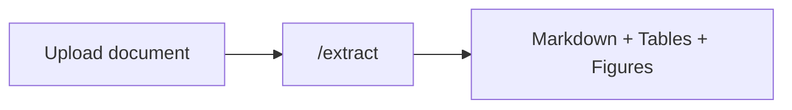

## Overview

The **Extract** pipeline is the simplest and most common way to use Pulse. Upload a document and get back clean, layout-aware markdown along with extracted tables, figures, bounding boxes, and optional chunks.

This is the starting point for every other pipeline — [Extract → Schema](/platform-reference/extract-schema) and [Extract → Split → Schema](/platform-reference/extract-split-schema) both build on top of this step.



---

## When to Use

- **RAG ingestion** — feed clean markdown into a vector database
- **Search indexing** — convert documents to searchable text
- **Content migration** — pull content out of PDFs into your CMS
- **Table extraction** — grab structured tables from financial reports, invoices, or spreadsheets
- **General-purpose parsing** — convert any supported file type to machine-readable text

---

## Supported File Types

Pulse handles a wide range of document formats out of the box:

| Category | Extensions |
|----------|-----------|
| **PDF** | `.pdf` — text-based, scanned/image-based, mixed, multi-page |
| **Images** | `.jpg`, `.jpeg`, `.png` — scans, photos, screenshots |
| **Office** | `.docx`, `.pptx`, `.xlsx` — Word, PowerPoint, Excel |
| **Web** | `.html`, `.htm` — saved web pages, HTML emails |

<Info>
  For the full breakdown including processing tips per format, see [Supported File Types](/api-reference/supported-file-types).
</Info>

---

## How to Use in the Playground

<Steps>

### Upload your document

Drag and drop a file or paste a URL into the upload area. You can also upload multiple documents at once for batch processing.

### Configure extraction settings

Adjust settings on the **Configuration** tab before extracting:

| Setting | What it does |
|---------|--------------|
| **Page range** | Process only specific pages (e.g. `1-5`, `3,7,12`) |
| **Extract figures** | Pull out embedded images and diagrams |
| **Figure descriptions** | Generate AI descriptions of extracted figures |
| **Show images** | Include inline images in the markdown output |
| **Return HTML** | Get HTML output in addition to markdown |
| **Effort mode** | Use more compute for higher accuracy on complex layouts |
| **Chunking** | Split output into semantic, header, page, or recursive chunks |
| **Chunk size** | Target token count per chunk |

{/* SCREENSHOT: extraction-settings-panel.png — The configuration tab showing extraction settings */}

### Click "Extract All"

The extraction runs (synchronously or asynchronously depending on document size). Progress is shown in the pipeline tabs.

### Review results

Results appear across several tabs:

- **Markdown** — Full document text with layout-aware formatting
- **Tables** — Detected tables rendered in a grid view
- **Bounding Boxes** — Visual overlay showing where each element was detected on the page
- **Chunks** — Chunked output (if chunking was enabled)

{/* SCREENSHOT: extraction-results-tabs.png — The results view showing markdown and tables tabs */}

</Steps>

---

## What You Get Back

| Field | Description |
|-------|-------------|
| `markdown` | Full document text with layout-aware markdown formatting |
| `html` | HTML output (if `return_html` was enabled) |
| `chunks` | Object with `semantic`, `header`, `page`, and/or `recursive` arrays |
| `bounding_boxes` | Coordinates for every text block, table, and figure |
| `extraction_id` | Saved extraction ID — use this for subsequent `/split` or `/schema` calls |
| `extraction_url` | Presigned URL to the stored extraction result |
| `page_count` | Number of pages processed |

<Tip>
  The `extraction_id` is the key to the rest of the Pulse pipeline. Once you have it, you can run [Schema](/platform-reference/extract-schema) or [Split](/platform-reference/extract-split-schema) on the same extraction without re-processing the document.
</Tip>

---

## API Usage

<Tabs>
  <Tab title="Python">
    ```python
    from pulse_python_sdk import Pulse

    client = Pulse(api_key="YOUR_API_KEY")

    # Synchronous extraction
    result = client.extract(
        file=open("invoice.pdf", "rb"),
        extract_figure=True,
        storage={"enabled": True}
    )

    print(result.markdown)
    print(f"Extraction ID: {result.extraction_id}")
    ```
  </Tab>
  <Tab title="TypeScript">
    ```typescript
    import { PulseClient } from "pulse-ts-sdk";
    import fs from "fs";

    const client = new PulseClient({
        headers: { "x-api-key": "YOUR_API_KEY" }
    });

    const result = await client.extract({
        file: fs.createReadStream("invoice.pdf"),
        extractFigure: true,
        storage: { enabled: true }
    });

    console.log(result.markdown);
    console.log("Extraction ID:", result.extractionId);
    ```
  </Tab>
  <Tab title="curl">
    ```bash
    curl -X POST https://api.runpulse.com/extract \
      -H "x-api-key: YOUR_API_KEY" \
      -F "file=@invoice.pdf" \
      -F "extract_figure=true" \
      -F 'storage={"enabled": true}'
    ```
  </Tab>
</Tabs>

For large documents, use async mode and poll for results:

```python
# Async extraction
result = client.extract(
    file=open("large_report.pdf", "rb"),
    async_=True,
    storage={"enabled": True}
)

job_id = result.job_id
# Poll GET /job/{job_id} until status is "completed"
```

See [Async Processing](/api-reference/async-processing) for the full polling flow.

---

## After Extraction

Once you have your `extraction_id`, you can:

<CardGroup cols={3}>
  <Card title="Add Schema" icon="table" href="/platform-reference/extract-schema">
    Extract structured data fields with a JSON Schema
  </Card>
  <Card title="Split & Schema" icon="scissors" href="/platform-reference/extract-split-schema">
    Divide into sections and extract per-section structured data
  </Card>
  <Card title="Export to Excel" icon="file-excel" href="/platform-reference/meridian">
    Convert detected tables to `.xlsx` with Meridian
  </Card>
</CardGroup>

---

## Related

<CardGroup cols={2}>
  <Card title="Extract API Reference" icon="code" href="/api-reference/endpoint/extract">
    Full API documentation for the `/extract` endpoint
  </Card>
  <Card title="Supported File Types" icon="file" href="/api-reference/supported-file-types">
    Detailed breakdown of every supported format
  </Card>
</CardGroup>

