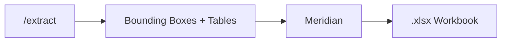

## Overview

**Meridian** is Pulse's built-in table-to-Excel conversion engine. After extracting a document, any tables detected by Pulse can be exported as a formatted `.xlsx` workbook — ready for downstream analysis, reporting, or integration.



---

## When to Use

- **Financial data** — export income statements, balance sheets, or transaction tables to Excel
- **Invoices** — convert line item tables to spreadsheets for accounting systems
- **Research data** — pull experimental results or survey tables into a workable format
- **Any document with tables** — if Pulse detects tables in the extraction, you can export them

---

## How to Use in the Playground

<Steps>

### Extract a document

Upload and extract your document using any pipeline — [Extract](/platform-reference/extract), [Extract → Schema](/platform-reference/extract-schema), or [Extract → Split → Schema](/platform-reference/extract-split-schema).

### Navigate to the Tables tab

After extraction, switch to the **Tables** tab to see all detected tables rendered in a grid view.

{/* SCREENSHOT: tables-tab.png — The Tables tab showing detected tables in grid view */}

### Click "Export to Excel"

Click the **Export** button (spreadsheet icon) in the extraction results toolbar. This opens the Meridian export flow.

### Select tables and configure

In the export view, you can:

- **Select/deselect tables** — choose which tables to include
- **Rename sheets** — customize the Excel sheet name for each table
- **Choose export mode** — separate workbooks per document, combined into one, or appended to an existing workbook

{/* SCREENSHOT: meridian-export-settings.png — The Meridian export view with table selection and format settings */}

### Configure formatting

Set Excel formatting preferences:

| Setting | Options |
|---------|---------|
| **Font family** | Arial, Calibri, Times New Roman, etc. |
| **Font size** | 8–16pt |
| **Font color** | Any hex color |
| **Alignment** | Left, Center, Right |
| **Bold / Italic / Underline** | Toggle each |
| **Column width** | Auto or fixed |
| **Row height** | Auto or fixed |

{/* SCREENSHOT: meridian-format-settings.png — The format settings panel with font, size, and alignment options */}

### Export

Click **Export All**. The workbook is generated and downloaded to your browser as a `.xlsx` file.

</Steps>

---

## Export Modes

| Mode | Description |
|------|-------------|
| **Separate** | One `.xlsx` file per document. Each table gets its own sheet within the workbook. |
| **Combined** | All tables from all documents merged into a single `.xlsx` file. Each table gets its own sheet. |
| **Appended** | Tables are added to an existing `.xlsx` workbook you upload. You can append to an existing sheet (vertically or horizontally) or create new sheets. |

---

## Appending to Existing Workbooks

The **Appended** mode is uniquely powerful — upload an existing Excel file and Meridian will add the newly extracted tables to it:

- **Vertical append** — new rows added below existing data in a target sheet
- **Horizontal append** — new columns added to the right of existing data
- **New tab** — each table becomes a new sheet in the existing workbook

Options for vertical append:
- **Include unmatched columns** — add columns from the new table that don't exist in the target
- **Add identifier column** — insert a column to tag rows by their source document

---

## API Usage

The Meridian conversion is available via the `/meridian-convert` endpoint:

<Tabs>
  <Tab title="Python">
    ```python
    import requests

    # After extraction, you have bounding_boxes with table data
    tables = [
        {
            "name": "Income Statement",
            "rows": 5,
            "columns": 3,
            "page": 1,
            "cells": [
                {"rowIndex": 0, "columnIndex": 0, "content": "Category"},
                {"rowIndex": 0, "columnIndex": 1, "content": "Q1"},
                {"rowIndex": 0, "columnIndex": 2, "content": "Q2"},
                {"rowIndex": 1, "columnIndex": 0, "content": "Revenue"},
                {"rowIndex": 1, "columnIndex": 1, "content": "1200000"},
                {"rowIndex": 1, "columnIndex": 2, "content": "1350000"}
            ],
            "customSheetName": "Income Statement"
        }
    ]

    response = requests.post(
        "https://api.runpulse.com/meridian-convert",
        headers={"x-api-key": "YOUR_API_KEY"},
        json={
            "tables": tables,
            "filename": "financial_tables.xlsx",
            "formatSettings": {
                "fontFamily": "Calibri",
                "fontSize": 11,
                "alignment": "left"
            }
        }
    )

    # Response contains a presigned download URL
    download_url = response.json()["presigned_url"]
    print(f"Download: {download_url}")
    ```
  </Tab>
  <Tab title="curl">
    ```bash
    curl -X POST https://api.runpulse.com/meridian-convert \
      -H "x-api-key: YOUR_API_KEY" \
      -H "Content-Type: application/json" \
      -d '{
        "tables": [
          {
            "name": "Income Statement",
            "rows": 5,
            "columns": 3,
            "page": 1,
            "cells": [
              {"rowIndex": 0, "columnIndex": 0, "content": "Category"},
              {"rowIndex": 0, "columnIndex": 1, "content": "Q1"},
              {"rowIndex": 0, "columnIndex": 2, "content": "Q2"}
            ],
            "customSheetName": "Income Statement"
          }
        ],
        "filename": "financial_tables.xlsx",
        "formatSettings": {
          "fontFamily": "Calibri",
          "fontSize": 11,
          "alignment": "left"
        }
      }'
    ```
  </Tab>
</Tabs>

### Response

```json
{
  "s3_object_url": "https://bucket.s3.amazonaws.com/meridian-convert/.../financial_tables.xlsx",
  "presigned_url": "https://bucket.s3.amazonaws.com/meridian-convert/...?X-Amz-Signature=...",
  "filename": "financial_tables.xlsx",
  "content_type": "application/vnd.openxmlformats-officedocument.spreadsheetml.sheet"
}
```

The `presigned_url` is valid for **7 days** and can be used to download the file directly.

---

## End-to-End: Extract → Meridian

A common workflow is to extract a document with tables and immediately convert them to Excel:

```python
from pulse_python_sdk import Pulse
import requests

client = Pulse(api_key="YOUR_API_KEY")

# 1. Extract the document
result = client.extract(
    file=open("financial_report.pdf", "rb"),
    extract_figure=True,
    storage={"enabled": True}
)

# 2. Get tables from bounding_boxes
bounding_boxes = result.bounding_boxes or {}
raw_tables = bounding_boxes.get("Tables", [])

# 3. Convert to Meridian table format
tables = []
for i, tbl in enumerate(raw_tables):
    cells = [
        {
            "rowIndex": c["position"]["row"],
            "columnIndex": c["position"]["column"],
            "content": c.get("text", "")
        }
        for c in tbl.get("cell_data", [])
    ]
    tables.append({
        "name": f"Table {i+1}",
        "rows": tbl.get("table_info", {}).get("dimensions", {}).get("rows", 0),
        "columns": tbl.get("table_info", {}).get("dimensions", {}).get("columns", 0),
        "page": 1,
        "cells": cells,
        "customSheetName": f"Table {i+1}"
    })

# 4. Export to Excel
resp = requests.post(
    "https://api.runpulse.com/meridian-convert",
    headers={"x-api-key": "YOUR_API_KEY"},
    json={"tables": tables, "filename": "report_tables.xlsx"}
)

print(f"Download: {resp.json()['presigned_url']}")
```

---

## Related

<CardGroup cols={2}>
  <Card title="Extract Pipeline" icon="file-lines" href="/platform-reference/extract">
    The extraction step that produces the tables for Meridian
  </Card>
  <Card title="Bounding Boxes" icon="vector-square" href="/api-reference/bounding-boxes">
    Understanding the bounding box output that powers table detection
  </Card>
</CardGroup>

