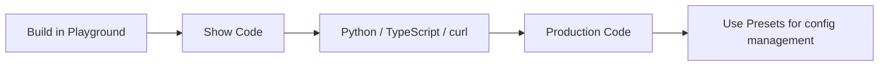

## Overview

The Pulse Playground is designed for **building and testing** your extraction pipeline visually. Once you're happy with the results, the **Show Code** feature generates ready-to-run SDK code that reproduces your exact configuration — making the transition from Playground to production seamless.



---

## The Show Code Feature

<Steps>

### Configure your pipeline

Set up your extraction settings, split topics, and/or schema in the Playground as you normally would. Run it on a sample document to verify the results.

### Click "Show Code"

Click the **`</> Show Code`** button in the pipeline configuration panel. A modal opens with generated code matching your exact configuration.

{/* SCREENSHOT: show-code-button.png — The Show Code button in the pipeline toolbar */}

### Select your language

Choose from **Python**, **TypeScript**, or **curl** using the language tabs at the top of the modal.

{/* SCREENSHOT: show-code-modal.png — The Show Code modal with language tabs and generated code */}

### Copy and integrate

Click **Copy** to copy the code to your clipboard. The code is ready to run — just replace `YOUR_API_KEY` and the file path with your actual values.

</Steps>

---

## What Gets Included

The generated code reflects your **exact** Playground configuration:

| Setting | Included? |
|---------|-----------|
| Page range | ✅ If set |
| Figure extraction | ✅ If enabled |
| Figure descriptions | ✅ If enabled |
| Show images | ✅ If enabled |
| Return HTML | ✅ If enabled |
| Effort mode | ✅ If enabled |
| Chunking settings | ✅ If configured |
| Chunk size | ✅ If set |
| Split topics | ✅ If split step added |
| Schema (single mode) | ✅ If schema step added |
| Per-topic schemas (split mode) | ✅ If split + schema configured |
| Saved preset IDs | ✅ Uses config IDs when presets are loaded |

---

## Generated Code Examples

### Extract Only

<Tabs>
  <Tab title="Python">
    ```python
    from pulse_python_sdk import Pulse

    client = Pulse(api_key="YOUR_API_KEY")

    result = client.extract(
        file=open("your_document.pdf", "rb"),
        extract_figure=True,
        return_html=False,
        storage={"enabled": True}
    )

    print(result.markdown)
    print(f"Extraction ID: {result.extraction_id}")
    ```
  </Tab>
  <Tab title="TypeScript">
    ```typescript
    import { PulseClient } from "pulse-ts-sdk";
    import fs from "fs";

    const client = new PulseClient({
        headers: { "x-api-key": "YOUR_API_KEY" }
    });

    const result = await client.extract({
        file: fs.createReadStream("your_document.pdf"),
        extractFigure: true,
        returnHtml: false,
        storage: { enabled: true }
    });

    console.log(result.markdown);
    console.log("Extraction ID:", result.extractionId);
    ```
  </Tab>
  <Tab title="curl">
    ```bash
    curl -X POST https://api.runpulse.com/extract \
      -H "x-api-key: YOUR_API_KEY" \
      -F "file=@your_document.pdf" \
      -F "extract_figure=true" \
      -F "return_html=false"
    ```
  </Tab>
</Tabs>

### Extract → Split → Schema

<Tabs>
  <Tab title="Python">
    ```python
    from pulse_python_sdk import Pulse

    client = Pulse(api_key="YOUR_API_KEY")

    # Extract
    result = client.extract(
        file=open("your_document.pdf", "rb"),
        extract_figure=True,
        storage={"enabled": True}
    )
    extraction_id = result.extraction_id

    # Split
    split_result = client.split.document(
        extraction_id=extraction_id,
        split_config={
            "topics": [
                {"name": "Financials", "description": "Revenue and expense data"},
                {"name": "Leadership", "description": "Executive team information"}
            ]
        }
    )
    split_id = split_result.split_id

    # Schema per topic
    schema_result = client.schema.extract_schema(
        split_id=split_id,
        split_schema_config={
            "Financials": {
                "schema": {"type": "object", "properties": {"revenue": {"type": "number"}}},
                "schema_prompt": "Extract financial metrics"
            },
            "Leadership": {
                "schema": {"type": "object", "properties": {"ceo": {"type": "string"}}},
                "schema_prompt": "Extract leadership info"
            }
        }
    )

    print(schema_result.results)
    ```
  </Tab>
  <Tab title="TypeScript">
    ```typescript
    import { PulseClient } from "pulse-ts-sdk";
    import fs from "fs";

    const client = new PulseClient({
        headers: { "x-api-key": "YOUR_API_KEY" }
    });

    // Extract
    const result = await client.extract({
        file: fs.createReadStream("your_document.pdf"),
        extractFigure: true,
        storage: { enabled: true }
    });
    const extractionId = result.extractionId;

    // Split
    const splitResult = await client.split.document({
        extraction_id: extractionId,
        split_config: {
            topics: [
                { name: "Financials", description: "Revenue and expense data" },
                { name: "Leadership", description: "Executive team information" }
            ]
        }
    });
    const splitId = splitResult.splitId;

    // Schema per topic
    const schemaResult = await client.schema.extractSchema({
        split_id: splitId,
        split_schema_config: {
            Financials: {
                schema: { type: "object", properties: { revenue: { type: "number" } } },
                schema_prompt: "Extract financial metrics"
            },
            Leadership: {
                schema: { type: "object", properties: { ceo: { type: "string" } } },
                schema_prompt: "Extract leadership info"
            }
        }
    });

    console.log(schemaResult.results);
    ```
  </Tab>
  <Tab title="curl">
    ```bash
    # 1. Extract
    curl -X POST https://api.runpulse.com/extract \
      -H "x-api-key: YOUR_API_KEY" \
      -F "file=@your_document.pdf" \
      -F "extract_figure=true"
    # Save extraction_id

    # 2. Split
    curl -X POST https://api.runpulse.com/split \
      -H "x-api-key: YOUR_API_KEY" \
      -H "Content-Type: application/json" \
      -d '{
        "extraction_id": "EXTRACTION_ID",
        "split_config": {
          "topics": [
            {"name": "Financials", "description": "Revenue and expense data"},
            {"name": "Leadership", "description": "Executive team information"}
          ]
        }
      }'
    # Save split_id

    # 3. Schema per topic
    curl -X POST https://api.runpulse.com/schema \
      -H "x-api-key: YOUR_API_KEY" \
      -H "Content-Type: application/json" \
      -d '{
        "split_id": "SPLIT_ID",
        "split_schema_config": {
          "Financials": {
            "schema": {"type": "object", "properties": {"revenue": {"type": "number"}}},
            "schema_prompt": "Extract financial metrics"
          },
          "Leadership": {
            "schema": {"type": "object", "properties": {"ceo": {"type": "string"}}},
            "schema_prompt": "Extract leadership info"
          }
        }
      }'
    ```
  </Tab>
</Tabs>

---

## Using Presets in Production

If your pipeline uses a **saved preset** (rather than inline configuration), the generated code references the preset's config ID:

```python
# Show Code output when using a saved preset
result = client.extract(
    file=open("your_document.pdf", "rb"),
    extraction_config_id="abc123-saved-preset-id",
    storage={"enabled": True}
)
```

This is the recommended approach for production because:
- **Centralized config** — update the preset once, all future runs pick up the change
- **Team consistency** — everyone references the same validated configuration
- **Cleaner code** — no need to inline large schemas in every request

<Note>
  If you've edited a preset's settings in the current session without saving, the generated code uses the **edited inline settings** rather than the preset ID — ensuring the code matches what you see in the Playground.
</Note>

See [Step Preset Library](/platform-reference/step-preset-library) for the full guide on saving and using presets.

---

## Production Best Practices

<AccordionGroup>
  <Accordion title="Use async mode for production workloads">
    Always use `async_=True` (Python) or `async: true` (TypeScript/curl) in production. This returns immediately with a `job_id` that you poll, preventing request timeouts on large documents.
    
    See [Async Processing](/api-reference/async-processing) for the polling pattern.
  </Accordion>

  <Accordion title="Enable storage">
    Pass `storage={"enabled": True}` so Pulse saves the extraction result. This lets you run `/split` and `/schema` on the same extraction later without re-processing.
  </Accordion>

  <Accordion title="Use webhooks for event-driven architectures">
    Instead of polling, register a webhook URL and Pulse will POST the result to you when processing completes.
    
    See [Webhooks](/api-reference/endpoint/webhook) for setup.
  </Accordion>

  <Accordion title="Handle errors gracefully">
    The API returns structured error codes. Always check for error responses and implement retry logic for transient failures.
    
    See [Error Handling](/advanced/error-handling) for the full error code reference.
  </Accordion>

  <Accordion title="Use config IDs for repeatability">
    If you're running the same pipeline across many documents, save your settings as presets and use the config IDs. This makes your API calls shorter and your configuration auditable.
  </Accordion>
</AccordionGroup>

---

## Related

<CardGroup cols={2}>
  <Card title="Step Preset Library" icon="bookmark" href="/platform-reference/step-preset-library">
    Save and reuse pipeline configurations with config IDs
  </Card>
  <Card title="API Quickstart" icon="rocket" href="/quickstart">
    Get started with the Pulse API in 5 minutes
  </Card>
</CardGroup>

