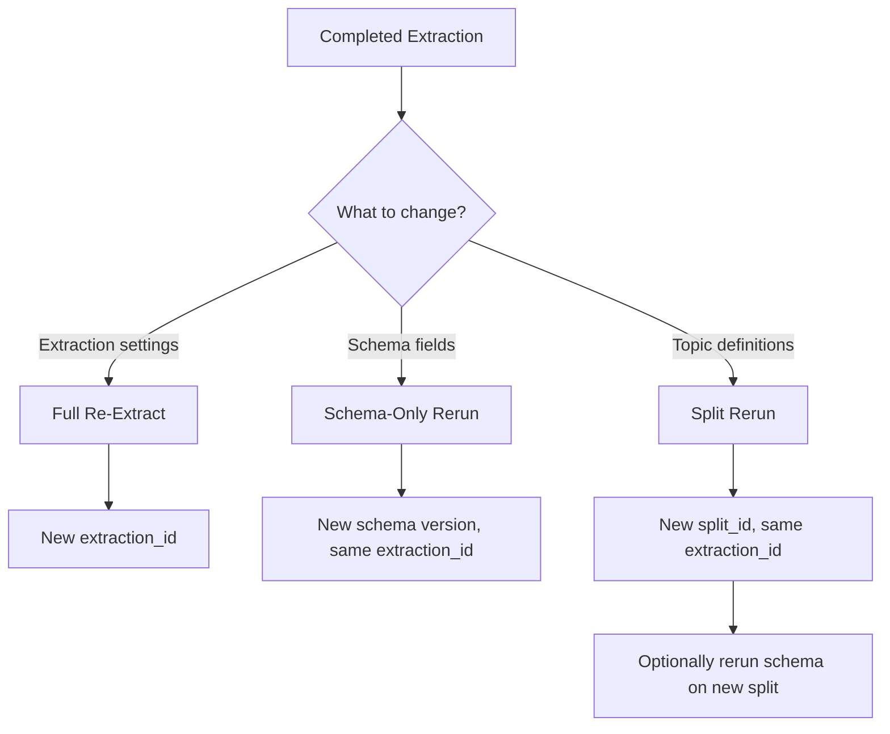

## Overview

After extracting a document, you don't need to start from scratch to adjust your results. The Pulse Playground supports several types of reruns that let you iterate on processing settings, schemas, and splits without re-uploading or re-extracting the document.

---

## Types of Reruns

### 1. Full Re-Extraction

Re-processes the entire document from scratch with new extraction settings. This re-uploads the original file and runs a fresh extraction.

**When to use:**
- You want to change extraction settings (page range, figure extraction, chunking)
- The original extraction had issues you want to fix with different parameters

**How it works in the Playground:**

<Steps>

### Open an existing extraction

Navigate to the extraction detail view for a completed extraction.

### Click "Re-Extract"

The re-extraction panel opens with the current settings pre-populated.

### Adjust extraction settings

Modify page range, figure options, chunking, or any other extraction parameter.

### Run

Click **Re-Extract**. A new extraction job is created with a new `extraction_id`. The original extraction is preserved.

</Steps>

<Warning>
  Full re-extraction creates a **new extraction** — it does not modify the original. You'll be navigated to the new extraction result automatically.
</Warning>

**API equivalent:**

```python
# Re-extract with different settings
result = client.extract(
    file=open("document.pdf", "rb"),
    pages="1-10",           # different page range
    extract_figure=True,    # enable figures this time
    async_=True
)
```

---

### 2. Schema-Only Rerun

Applies a new or modified schema to an **existing extraction** without re-processing the document. This is the most common type of rerun — fast and cost-effective because extraction is not repeated.

**When to use:**
- You want to try a different schema on the same document
- You need to fix or refine extracted fields
- You want to extract additional fields from an already-processed document

**How it works in the Playground:**

<Steps>

### Open an existing extraction

Navigate to the extraction detail view and go to the **Schema** tab.

### Edit your schema

Modify the JSON Schema in the schema editor, or update the schema prompt.

### Click "Rerun Schema"

The schema is re-applied to the existing extraction data. Results update in-place in the Schema tab.

</Steps>

<Tip>
  Schema reruns are fast because they operate on the already-extracted content stored in Pulse — no document re-processing needed. You can iterate on schemas as many times as you want.
</Tip>

**API equivalent:**

```python
# Apply a new schema to an existing extraction
schema_result = client.schema.extract_schema(
    extraction_id="existing-extraction-id",
    schema_config={
        "schema": {
            "type": "object",
            "properties": {
                "total_amount": {"type": "number"},
                "due_date": {"type": "string", "format": "date"}
            }
        },
        "schema_prompt": "Extract payment details"
    }
)

print(schema_result.schema_output)
```

Each schema rerun creates a new **schema version**, letting you compare results across different schema configurations.

---

### 3. Split Rerun

Re-runs the document split with different topics on an existing extraction. Useful when you want to reorganize how the document is sectioned.

**When to use:**
- You want to try different topic definitions
- You want to add or remove topics
- The initial split didn't assign pages correctly and you want to adjust topic descriptions

**How it works in the Playground:**

<Steps>

### Open an existing extraction

Navigate to the extraction detail view and go to the **Split** tab.

### Modify topics

Add, remove, or edit topic names and descriptions.

### Click "Rerun Split"

The split is re-applied to the existing extraction. Page assignments update based on the new topic definitions.

</Steps>

**API equivalent:**

```python
# Re-split with different topics
split_result = client.split.document(
    extraction_id="existing-extraction-id",
    split_config={
        "topics": [
            {"name": "Executive Summary", "description": "High-level overview"},
            {"name": "Financial Details", "description": "Revenue, costs, margins"},
            {"name": "Risk Factors", "description": "Identified risks and mitigations"}
        ]
    }
)

print(split_result.split_output)
```

---

## Rerun Workflow Summary



| Rerun Type | Re-processes document? | Creates new extraction? | Speed |
|------------|----------------------|------------------------|-------|
| **Full Re-Extraction** | ✅ Yes | ✅ Yes | Slow (full pipeline) |
| **Schema-Only** | ❌ No | ❌ No | Fast (seconds) |
| **Split Rerun** | ❌ No | ❌ No | Fast (seconds) |

---

## Schema Versioning

Each schema rerun creates a versioned result. In the Playground, you can:

- **Switch between versions** using the version selector in the Schema tab
- **Compare results** across different schema configurations
- **Roll back** to a previous version if a new schema didn't produce better results

This makes it easy to iteratively refine your schema without losing previous work.

## Related

<CardGroup cols={2}>
  <Card title="Pipeline Types" icon="diagram-project" href="/platform-reference/pipeline-types">
    Understanding the three pipeline configurations
  </Card>
  <Card title="Schema Endpoint" icon="table" href="/api-reference/endpoint/schema">
    API reference for the /schema endpoint
  </Card>
</CardGroup>

