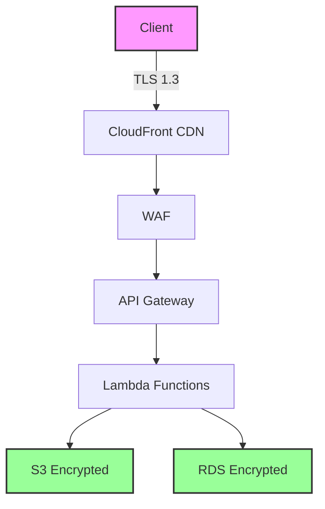

## Security Commitment

Pulse API is built with security at its core. We implement industry-leading security practices to protect your sensitive documents and data throughout the entire processing lifecycle.

## Compliance

<CardGroup cols={2}>
  <Card title="ISO 27001" icon="certificate">
    Information security management certification
  </Card>
  <Card title="GDPR Compliant" icon="flag">
    Full compliance with EU data protection regulations
  </Card>
  <Card title="SOC 2 Type II" icon="shield-check">
    Audited controls for security, availability, and confidentiality
  </Card>
  <Card title="HIPAA Compliant" icon="hospital">
    Safeguards for protected health information (PHI)
  </Card>
</CardGroup>

<Info>
  For detailed compliance and security information, <a href="https://www.runpulse.com/security">view our security page here</a>.
</Info>

## Data Protection

### Encryption

<AccordionGroup>
  <Accordion title="In Transit">
    - **TLS 1.3** for all API communications
    - Certificate pinning available for enterprise
    - Perfect forward secrecy enabled
    - Strong cipher suites only
  </Accordion>

  <Accordion title="At Rest">
    - **AES-256** encryption for stored data
    - Encrypted S3 buckets with customer-managed keys
    - Encrypted database backups
    - Secure key management via AWS KMS
  </Accordion>

  <Accordion title="Processing">
    - Isolated compute environments
    - Memory encryption for sensitive operations
    - Secure enclaves for key material
    - No data persistence on compute nodes
  </Accordion>
</AccordionGroup>

### Data Retention

| Data Type | Retention Period | Notes |
|-----------|------------------|-------|
| Uploaded files | 48 hours | Automatic deletion |
| Extraction results | 48 hours | Unless saved by user |
| API logs | 30 days | For debugging only |
| Audit logs | 1 year | Compliance requirement |

<Info>
  Enterprise customers can configure custom retention policies to meet their compliance requirements.
</Info>

## Infrastructure Security

### AWS Architecture

### Security Features

- **DDoS Protection**: AWS Shield Standard + CloudFront
- **Web Application Firewall**: AWS WAF with custom rules
- **Network Isolation**: VPC with private subnets
- **Access Control**: IAM roles with least privilege
- **Monitoring**: CloudWatch + GuardDuty threat detection

## Access Control

### API Authentication

- **API Keys**: Unique per organization
- **Key Rotation**: Supported and recommended
- **IP Allowlisting**: Available for enterprise
- **Rate Limiting**: Automatic abuse prevention

### Administrative Access

- **Multi-Factor Authentication**: Required for all staff
- **Role-Based Access Control**: Principle of least privilege
- **Audit Logging**: All administrative actions logged
- **Background Checks**: All employees screened

## Data Privacy

### Our Commitments

<CardGroup cols={2}>
  <Card title="No Training" icon="brain">
    Your data is never used to train our models
  </Card>
  <Card title="No Sharing" icon="users-slash">
    Data is never shared with third parties
  </Card>
  <Card title="No Persistence" icon="database">
    Automatic deletion after processing
  </Card>
  <Card title="No Access" icon="eye-slash">
    Staff cannot access your documents
  </Card>
</CardGroup>

### GDPR Compliance

- **Right to Access**: Export all your data
- **Right to Deletion**: Immediate purge available
- **Data Portability**: Standard formats
- **Privacy by Design**: Built-in from day one

## Security Monitoring

### Real-Time Protection

- **Threat Detection**: AWS GuardDuty + custom rules
- **Anomaly Detection**: ML-based pattern analysis
- **Security Scanning**: Continuous vulnerability assessment
- **Incident Response**: 24/7 security team for enterprise

### Audit Trail

All API operations are logged with:
- Timestamp
- API key identifier (hashed)
- Operation performed
- Response status
- IP address (hashed)

<Note>
  Logs are retained for 30 days and are available for security investigations only.
</Note>

## Vulnerability Management

### Security Practices

<Steps>
  <Step title="Code Review">
    All code peer-reviewed before deployment
  </Step>
  <Step title="Dependency Scanning">
    Automated scanning for vulnerable packages
  </Step>
  <Step title="Penetration Testing">
    Annual third-party security assessments
  </Step>
  <Step title="Bug Bounty">
    Responsible disclosure program (coming soon)
  </Step>
</Steps>

### Update Policy

- **Critical Patches**: Applied within 24 hours
- **Security Updates**: Applied within 7 days
- **Regular Updates**: Monthly maintenance window
- **Zero Downtime**: Rolling deployments

## Incident Response

### Response Plan

1. **Detection**: Automated monitoring + manual review
2. **Assessment**: Severity classification within 1 hour
3. **Containment**: Immediate isolation of affected systems
4. **Notification**: Customer notification per SLA
5. **Remediation**: Fix deployment and verification
6. **Post-Mortem**: Published within 5 business days

### Customer Notification

Enterprise customers receive:
- Immediate notification of incidents
- Regular status updates
- Post-incident report
- Remediation recommendations

## Best Practices for Users

<AccordionGroup>
  <Accordion title="API Key Security">
    - Store keys in environment variables
    - Never commit keys to version control
    - Rotate keys regularly (every 90 days)
    - Use different keys for different environments
    - Monitor key usage in Console
  </Accordion>

  <Accordion title="Document Handling">
    - Encrypt sensitive documents before upload
    - Use presigned URLs for direct S3 access
    - Process documents immediately after upload
    - Don't store extraction results permanently
  </Accordion>

  <Accordion title="Network Security">
    - Always use HTTPS connections
    - Implement webhook signature verification
    - Use IP allowlisting when possible
    - Monitor for unusual activity patterns
  </Accordion>
</AccordionGroup>

## Additional Security Information

For comprehensive security details and compliance documentation, please visit our <a href="https://www.runpulse.com/security">security page</a>.

## Report Security Issues

Found a security vulnerability? Please report it responsibly:

<Warning>
  Do NOT post security issues publicly. Email us directly for coordinated disclosure.
</Warning>

**Email**: [security@trypulse.ai](mailto:security@trypulse.ai)

**PGP Key**: Available upon request

We respond to all security reports within 24 hours and work with researchers to ensure issues are properly addressed.

## Next Steps

<CardGroup cols={2}>
  <Card title="Security Best Practices" icon="shield" href="/security/best-practices">
    Implementation guidelines
  </Card>
  <Card title="API Authentication" icon="key" href="/authentication">
    Secure your API calls
  </Card>
</CardGroup>
