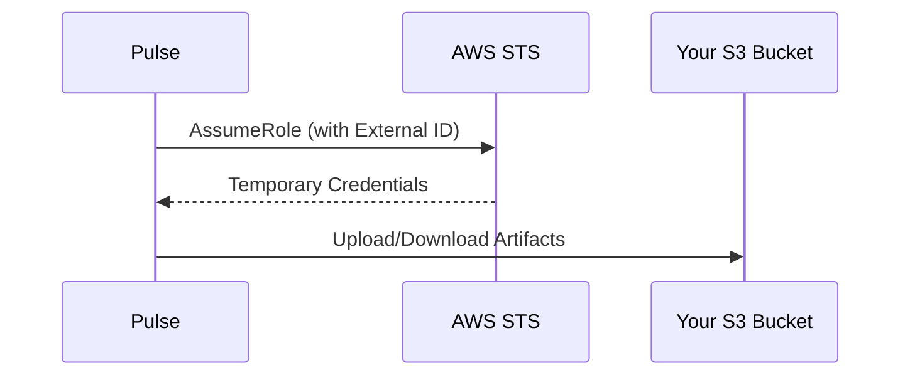

# Bring Your Own Storage: AWS S3

Store your extraction artifacts in your own AWS S3 bucket for complete data sovereignty and compliance requirements.

<Note>
Custom storage is available for Enterprise customers. [Contact sales](mailto:sales@runpulse.com) to enable this feature.
</Note>

## Overview

Pulse uses IAM role assumption for secure cross-account access to your S3 bucket. This approach:

- **No long-lived credentials** - We never store your AWS access keys
- **Temporary access** - Credentials are refreshed automatically
- **Confused deputy protection** - External ID prevents unauthorized access
- **Full audit trail** - All access is logged in your AWS CloudTrail

## Architecture



## Setup Steps

### Step 1: Create an S3 Bucket

Create a new S3 bucket in your AWS account to store extraction artifacts.

```bash
aws s3 mb s3://my-company-pulse-data --region us-east-1
```

**Recommended settings:**
- Enable versioning for data protection
- Enable server-side encryption (SSE-S3 or SSE-KMS)
- Configure lifecycle policies as needed

### Step 2: Create an IAM Role

Create an IAM role that Pulse can assume to access your bucket.

**Trust Policy:**

```json
{
  "Version": "2012-10-17",
  "Statement": [
    {
      "Effect": "Allow",
      "Principal": {
        "AWS": "arn:aws:iam::YOUR_PULSE_ACCOUNT_ID:root"
      },
      "Action": "sts:AssumeRole",
      "Condition": {
        "StringEquals": {
          "sts:ExternalId": "pulse-org-YOUR_ORG_ID"
        }
      }
    }
  ]
}
```

<Warning>
Replace `YOUR_PULSE_ACCOUNT_ID` with the Pulse AWS account ID provided in your console settings.
Replace `YOUR_ORG_ID` with your organization's ID from the Storage Settings page.
</Warning>

**Permission Policy:**

Attach this policy to the role to grant access to your S3 bucket:

```json
{
  "Version": "2012-10-17",
  "Statement": [
    {
      "Effect": "Allow",
      "Action": [
        "s3:PutObject",
        "s3:GetObject",
        "s3:DeleteObject",
        "s3:ListBucket",
        "s3:GetBucketLocation"
      ],
      "Resource": [
        "arn:aws:s3:::my-company-pulse-data",
        "arn:aws:s3:::my-company-pulse-data/*"
      ]
    }
  ]
}
```

### Step 3: Configure in Pulse Console

1. Navigate to **Settings > Storage** in the Pulse Console
2. Select **Amazon S3** as your storage provider
3. Enter the following details:
   - **IAM Role ARN**: `arn:aws:iam::123456789012:role/PulseStorageRole`
   - **S3 Bucket Name**: `my-company-pulse-data`
   - **AWS Region**: `us-east-1`
   - **Base Path** (optional): `extractions/` - prefix for all stored objects

4. Click **Save Configuration**

### Step 4: Test the Connection

Click **Test Connection** to verify that Pulse can access your bucket. The test will:

1. Assume the IAM role using the External ID
2. List objects in your bucket to verify permissions
3. Report success or any configuration issues

### Step 5: Enable Custom Storage

Once the connection test passes, toggle **Enabled** to start using your custom storage.

<Note>
After enabling, all new extractions will be stored in your S3 bucket. Existing extractions remain in Pulse's default storage.
</Note>

## Storage Structure

Pulse organizes artifacts in your bucket using this structure:

```
{base_path}/orgs/{org_id}/extractions/{job_id}/artifacts/
├── result.json          # Extraction results
├── original_file.pdf    # Original uploaded document
└── ...                  # Other artifacts
```

## Security Best Practices

<AccordionGroup>
  <Accordion title="Use a dedicated bucket">
    Create a separate bucket specifically for Pulse extractions rather than using an existing bucket with other data.
  </Accordion>
  
  <Accordion title="Enable encryption">
    Use SSE-S3 or SSE-KMS encryption for data at rest:
    ```bash
    aws s3api put-bucket-encryption \
      --bucket my-company-pulse-data \
      --server-side-encryption-configuration '{
        "Rules": [{"ApplyServerSideEncryptionByDefault": {"SSEAlgorithm": "AES256"}}]
      }'
    ```
  </Accordion>
  
  <Accordion title="Enable versioning">
    Protect against accidental deletion:
    ```bash
    aws s3api put-bucket-versioning \
      --bucket my-company-pulse-data \
      --versioning-configuration Status=Enabled
    ```
  </Accordion>
  
  <Accordion title="Configure lifecycle policies">
    Automatically transition or expire old extractions based on your retention requirements.
  </Accordion>
  
  <Accordion title="Enable CloudTrail logging">
    Monitor all access to your bucket through AWS CloudTrail for complete audit trails.
  </Accordion>
</AccordionGroup>

## Troubleshooting

<AccordionGroup>
  <Accordion title="AccessDenied error">
    - Verify the IAM role ARN is correct
    - Check that the External ID matches exactly: `pulse-org-{your_org_id}`
    - Ensure the permission policy includes all required S3 actions
    - Verify the bucket name in the policy matches your configuration
  </Accordion>
  
  <Accordion title="InvalidIdentityToken error">
    - The trust policy may not allow Pulse's AWS account
    - Contact support to verify the correct Pulse AWS account ID
  </Accordion>
  
  <Accordion title="NoSuchBucket error">
    - Verify the bucket name is spelled correctly
    - Ensure the bucket is in the specified region
  </Accordion>
</AccordionGroup>

## Reverting to Pulse Default Storage

To stop using custom storage and revert to Pulse's managed S3:

1. Toggle **Enabled** to off
2. Click **Reset to Default** if you want to remove the configuration entirely

<Warning>
Reverting does not migrate existing artifacts. Data in your S3 bucket remains there.
</Warning>


