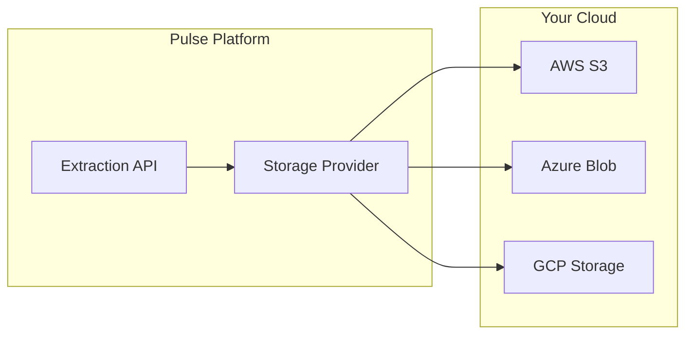

# Bring Your Own Storage (BYOS)

Pulse allows Enterprise customers to store their extraction artifacts in their own cloud storage infrastructure instead of Pulse's managed storage.

<Note>
Custom storage is available for Enterprise customers. [Contact sales](mailto:sales@runpulse.com) to enable this feature.
</Note>

## Why Use Custom Storage?

<CardGroup cols={2}>
  <Card title="Data Sovereignty" icon="shield">
    Keep all extracted data within your own infrastructure and geographic boundaries.
  </Card>
  <Card title="Compliance" icon="check-circle">
    Meet regulatory requirements like HIPAA, SOC 2, or GDPR by controlling where data is stored.
  </Card>
  <Card title="Integration" icon="link">
    Seamlessly integrate extracted data with your existing data pipelines and workflows.
  </Card>
  <Card title="Cost Optimization" icon="dollar-sign">
    Leverage existing storage contracts and optimize costs across your organization.
  </Card>
</CardGroup>

## Supported Providers

Pulse supports the following cloud storage providers:

| Provider | Authentication | Setup Guide |
|----------|---------------|-------------|
| **Amazon S3** | IAM Role (AssumeRole) | [AWS S3 Setup](/storage/aws-s3) |
| **Azure Blob Storage** | Connection String or SAS Token | [Azure Blob Setup](/storage/azure-blob) |
| **Google Cloud Storage** | Service Account JSON | [GCP Setup](/storage/gcp-cloud-storage) |

## How It Works



When you enable custom storage:

1. **Configure** - Set up your cloud storage and provide credentials to Pulse
2. **Test** - Verify connectivity and permissions with the Test Connection feature
3. **Enable** - Toggle on custom storage to start using it
4. **Use** - All new extractions are automatically stored in your bucket/container

## What Gets Stored

Each extraction creates the following artifacts:

| Artifact | Description |
|----------|-------------|
| `result.json` | Complete extraction results including markdown, structured data, and metadata |
| `original_file.*` | The original uploaded document (PDF, image, etc.) |

Artifacts are organized in a predictable structure:

```
{base_path}/orgs/{org_id}/extractions/{job_id}/artifacts/
├── result.json
└── original_file.pdf
```

## Security

<AccordionGroup>
  <Accordion title="AWS S3: IAM Role Assumption">
    Pulse uses AWS STS AssumeRole with an External ID. No long-lived credentials are stored in Pulse - we obtain temporary credentials on-demand.
  </Accordion>
  
  <Accordion title="Azure: Connection String or SAS Token">
    Credentials are encrypted at rest in Pulse's database using AES-256 encryption.
  </Accordion>
  
  <Accordion title="GCP: Service Account JSON">
    Service account keys are encrypted at rest. Use key rotation and audit logging for enhanced security.
  </Accordion>
</AccordionGroup>

## Getting Started

1. **Check your plan** - Custom storage is available for Enterprise customers
2. **Choose a provider** - Select AWS S3, Azure Blob, or GCP Cloud Storage
3. **Follow the setup guide** - Complete the provider-specific configuration
4. **Configure in Pulse** - Add your storage credentials in Settings > Storage
5. **Test and enable** - Verify the connection and enable custom storage

<CardGroup cols={3}>
  <Card title="AWS S3" icon="aws" href="/storage/aws-s3">
    Set up IAM role for S3 access
  </Card>
  <Card title="Azure Blob" icon="microsoft" href="/storage/azure-blob">
    Configure Azure Blob Storage
  </Card>
  <Card title="GCP Storage" icon="google" href="/storage/gcp-cloud-storage">
    Set up GCP Cloud Storage
  </Card>
</CardGroup>

## API Reference

For programmatic storage configuration, see the [Storage API Reference](/api-reference/endpoint/storage).


